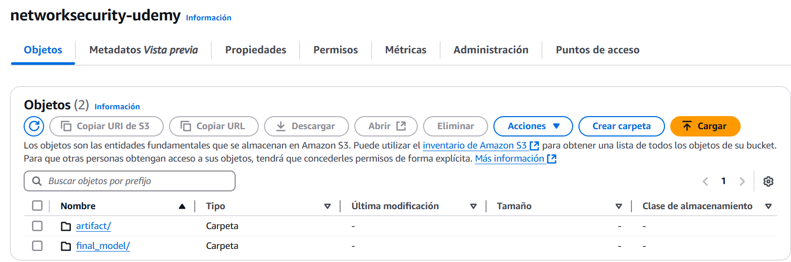

# Network security project for phishing data

## Setup file creation

## Environment

El environment se crea de manera local con:
```
conda create -p .venv python=3.10
```
y se activa con:
```
conda activate ./.venv
```
Después, se pueden instalar las librerias.

## ETL Pipeline


el vido 127 explica lo que es un etl. hay que explicarlo aqui.


para eso se crea un clsuter en mongodb

el primer paso es la ingestion desde el csv a mongo db.

luego viene la data ingestion part


## data validation

data drif, data schema.

## Variables de entorno
en el archivo .env deberá haber las siguientes variables
MONGO_DB_URL


### Iam policies
Para subir los modelos a aws, se debe descargar el cli y crear un usuario iam.
A este usuario se le dan permisos de AmazonS3FullAccess.

Con el usuario aim creado, se le dan claves de acceso para el cli. Con esas claves, se va al cli y se configura con 
"""{cmd}
aws configure
"""



### CI/CD
Se crea un repo en ECR en AWS
Se agrega el repo erc como secretos en github.

el usuario im necesita permisos AmazonEC2ContainerRegistryFullAccess para logear el docker en ec2.

#### Continuous deployment.
EL self hosted es como un event listener

Al lanzar la instancia ec2 (se lanza una instancia t2.medium de ubuntu), se deben ejecutar los siguientes comandos en ella:
sudo apt-get update -y
sudo apt-get upgrade

curl -fsSL https://get.docker.com -o get-docker.sh
sudo sh get-docker.sh
sudo usermod -aG docker ubuntu
newgrp docker

una vez hecho esto vamos al repo de github y vamos a settings -> Actions -> Runners