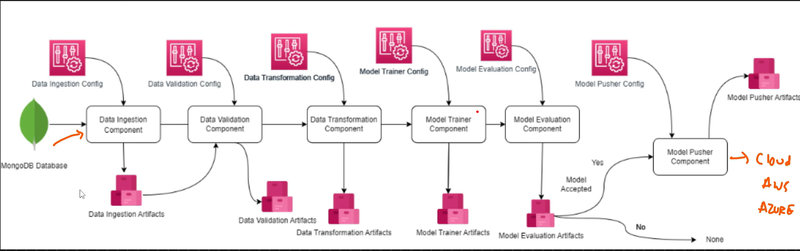
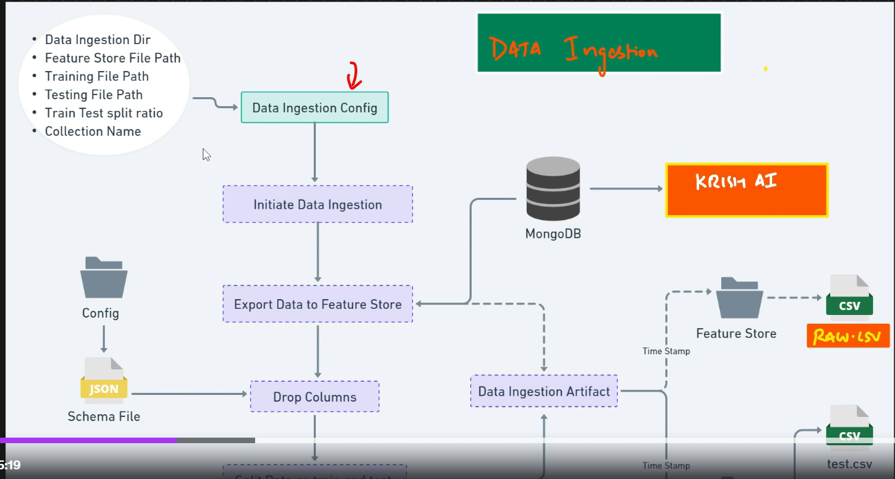

# Network security project for phishing data

## Setup file creation

## ETL Pipeline

el vido 127 explica lo que es un etl. hay que explciarlo aqui.

para eso se crea un clsuter en mongodb

el primer paso es la ingestion desde el csv a mongo db.

luego viene la data ingestion part

